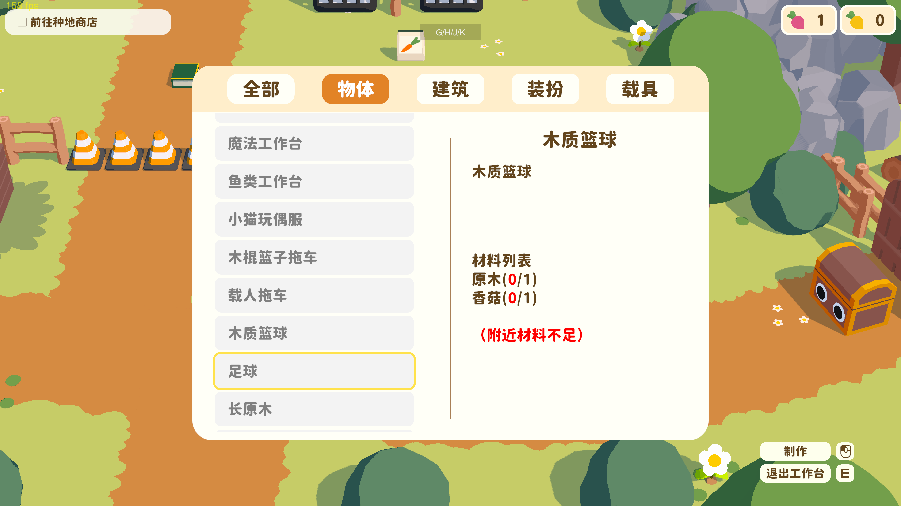
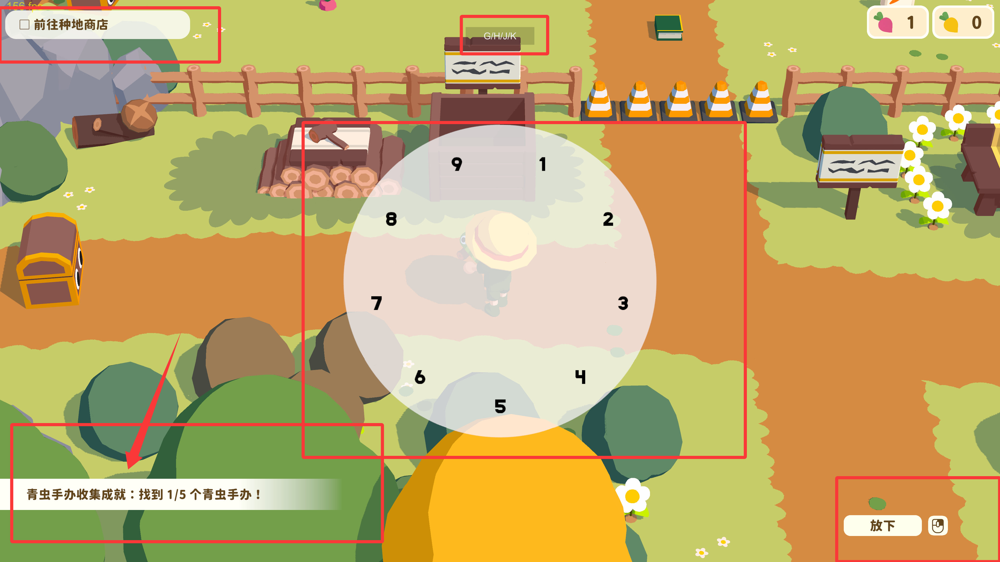
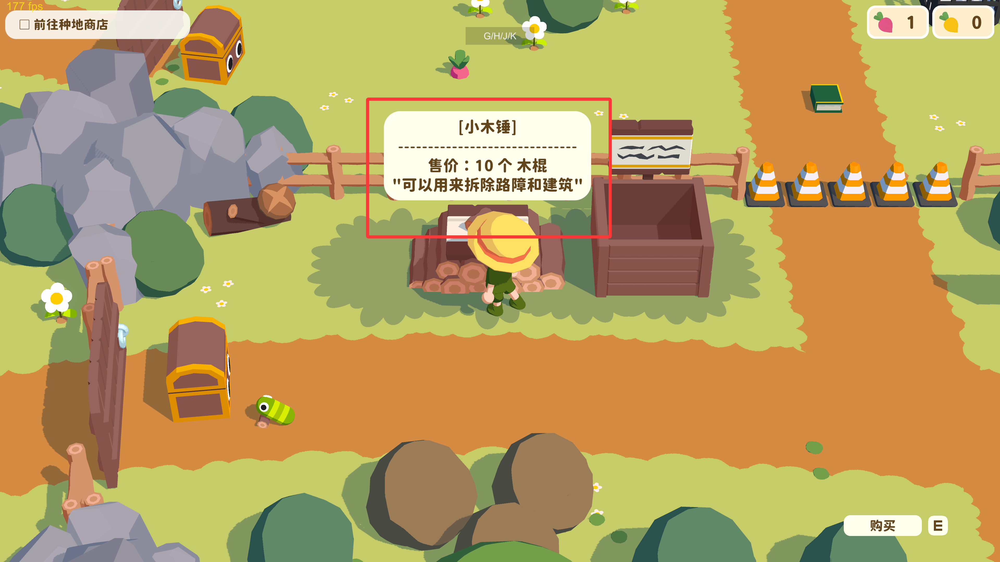

# 舒舒服服小岛时光文字朗读插件

这是一个给《舒舒服服小岛时光 / Cozy Island》做的文字朗读学习插件。它的目标很简单：小朋友在玩游戏时，可以按键朗读当前界面文字，把材料、配方、任务、成就和剧情内容变成可听、可跟读的学习材料。

> 本项目不是游戏官方项目，不包含游戏本体、游戏资源、游戏 DLL 或任何账号凭证；可选语音缓存作为 Release 附件单独提供。

## 效果预览

截图中的红框是功能说明标注，不是插件实际绘制的红框。插件本体只会在顶部显示一个很小的 `G/H/J/K` 提示。

### 工作台摘要朗读

工作台和制作界面的文字很多，插件会优先朗读右侧当前选中配方的摘要，例如名称、说明、材料需求和材料是否不足，避免把左侧长列表全部读出来。



### 分区按键朗读

`G/H/J/K` 用来分别朗读主要内容、左上角任务、左下角成就和右下角操作提示。这样不用鼠标，也能在不同游戏场景里快速听到对应区域的文字。



### 商店和提示文本朗读

商店、告示牌、弹窗说明这类居中的文本，也可以通过 `G` 读取。第一次没有缓存时会生成语音，之后再次遇到相同文本会直接播放本地缓存。



## 功能特性

- 基于 BepInEx 5 加载，不修改游戏本体文件。
- 支持键盘朗读：
  - `G`：朗读当前主要内容。
  - `H`：朗读左上角任务清单。
  - `J`：朗读左下角成就区域。
  - `K`：朗读右下角操作提示。
- 自动扫描当前可见的 Unity UI / TextMeshPro 文本。
- 针对工作台、制作界面做摘要朗读，只读当前选中配方的名称、说明、材料需求和状态。
- 优先播放本地 MiMo TTS 语音缓存。
- 缓存未命中时，使用 Windows 本机 TTS 生成 WAV，并保存为本地缓存。
- 顶部只显示很小的 `G/H/J/K` 提示，尽量不遮挡游戏画面。

## 下载与安装

普通玩家不需要自己编译源码，建议直接到 Releases 下载插件包：

```text
CozyIslandReadAloud-v0.1.1.zip
```

如果希望减少第一次朗读时的等待，可以额外下载可选语音缓存包：

```text
CozyIslandReadAloud-mimo-tts-cache-zh-CN-v0.1.1.zip
```

安装步骤：

1. 先给游戏安装 BepInEx 5 x64。
2. 下载 Release 里的插件 zip。
3. 解压后，把 `CozyIslandReadAloud` 文件夹放到游戏目录：

```text
CozyIsland/BepInEx/plugins/CozyIslandReadAloud/
```

4. 启动游戏。
5. 进入游戏界面后按 `G/H/J/K` 测试朗读。

可选语音缓存包的使用方法：

1. 解压 `CozyIslandReadAloud-mimo-tts-cache-zh-CN-v0.1.1.zip`。
2. 把里面的 `audio_cache` 文件夹复制到插件目录：

```text
CozyIsland/BepInEx/plugins/CozyIslandReadAloud/audio_cache/
```

如果某段文字第一次没有本地语音缓存，插件会调用 Windows TTS 生成一次。之后再次遇到相同文本，会直接播放本地缓存。

## 文本提取参考思路

本插件运行时会直接读取当前可见 UI 文本，普通使用不需要提前准备完整文本库。

如果你想给自己的学习软件准备词表或批量语音，可以让 AI 辅助整理游戏文本。当前批量语音脚本默认读取：

```text
learning_text/cozyisland_text_extract.tsv
```

对应解析逻辑在：

```text
tools/generate-mimo-cache.mjs
```

可以参考这个提示词让 AI 帮你整理文本：

```text
请帮我从游戏资源文本中提取适合儿童认字学习的中文内容，整理为 TSV。
字段为：category、zh、english。
category 可以使用：任务/句子、界面/任务、地点/工具、配方/蓝图、物品/短词。
请去掉无意义符号、调试文本、按键提示、纯数字和重复项。
保留材料名、道具名、制作说明、任务句子和剧情对话。
```

## 语音缓存说明

插件朗读时的查找顺序：

1. MiMo 预生成 WAV 缓存。
2. MiMo 分段缓存。
3. Windows TTS WAV 缓存。
4. Windows TTS 现场生成并保存缓存。

默认缓存位置：

```text
audio_cache/mimo/zh-CN/
audio_cache/windows/zh-CN/
```

从 Release zip 安装时，缓存会保存在插件目录下。用源码安装时，缓存会保存在本项目目录下。

## 从源码构建

准备条件：

- Windows
- Steam 版《舒舒服服小岛时光 / Cozy Island》
- .NET SDK
- BepInEx 5 x64

把 BepInEx 5 x64 解压到本项目的 `deps/` 目录，结构示例：

```text
deps/
  BepInEx_win_x64_5.4.23.2/
    BepInEx/
    winhttp.dll
    doorstop_config.ini
```

构建插件：

```powershell
.\build-package.ps1
```

构建产物会输出到：

```text
dist/CozyIslandReadAloud/
```

## 从源码安装

如果游戏安装在 Steam 目录：

```powershell
.\install-to-game.ps1 -GameDir "F:\Steam\steamapps\common\CozyIsland"
```

如果没有传 `GameDir`，脚本会尝试使用默认相对路径。建议明确传入游戏目录，比较稳。

## 批量生成 MiMo 语音

设置 `MIMO_API_KEY` 后可以批量生成语音缓存：

```powershell
$env:MIMO_API_KEY="your_api_key"
$env:MIMO_SCOPE="broad"
$env:MIMO_BATCH_LIMIT="100"
node .\tools\generate-mimo-cache.mjs
```

常用参数：

- `MIMO_SCOPE=dialogue|broad|all`
- `MIMO_BATCH_LIMIT=100`
- `MIMO_CONCURRENCY=1`
- `MIMO_VOICE=冰糖`

注意：批量语音缓存不建议提交到源码仓库。如果要个人备份，可以自行压缩保存。

## 语音来源说明

项目里提到的 MiMo，是小米开放平台的文字转语音模型。`冰糖` 是 MiMo 预置音色名，不是本项目自己定义的角色名。

当前语音策略：

- 预生成语音使用 MiMo V2.5 TTS。
- 预生成音色使用 `冰糖`，偏清晰、活泼的中文女声。
- 游戏运行时不会联网调用 MiMo API。
- 插件只会读取本地 MiMo 缓存文件。
- 没有命中 MiMo 缓存时，才会调用 Windows 本机 TTS 生成语音。

如果你不使用 MiMo，也可以只依赖 Windows TTS。第一次读某段文字时会慢一点，生成完成后会缓存到本地。

## 常见问题

**按键没有声音怎么办？**

先确认游戏已经安装 BepInEx，插件 DLL 位于 `BepInEx/plugins/CozyIslandReadAloud/`。再查看 `BepInEx/LogOutput.log` 是否有插件加载日志。

**第一次按键为什么要等一下？**

如果没有命中 MiMo 或 Windows 缓存，插件会现场调用 Windows TTS 生成 WAV。生成完成后会自动播放，之后同一段文本会直接播放缓存。

**为什么工作台不读左侧一长串列表？**

工作台界面文字很多，全部朗读会很吵。插件检测到制作界面后，会优先朗读右侧当前选中配方的摘要，例如名称、说明、材料和是否不足。

## 开源协议

MIT License

## 友情链接

- [Linux DO](https://linux.do/)

以上链接仅作为社区参考，不代表本项目与对应社区存在官方合作关系。
